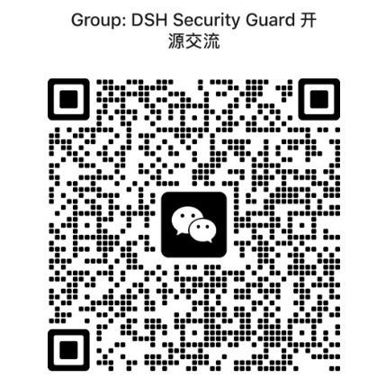

<p align="center">
  <a href="./README.md"><b>English</b></a> |
  <a href="./README_CN.md">简体中文</a>
</p>

# deepseek-harness-security-guard

A local, rule-based security guard for DeepSeek Harness agents. It hooks agent tool calls and prompt assembly and applies a policy table with `allow` / `block` / `ask` / `warn` decisions.

<p align="center">
  <a href="https://github.com/SparkShieldLab/deepseek-harness-security-guard"></a>
  <a href="https://sai.xingdun-ai.com/home"></a>
  <a href="https://open.weixin.qq.com/qr/code?username=gh_89d544e1b8aa"></a>
</p>

<p align="center">
  <!-- Demo: a prompt-injection attempt is blocked, then reviewed in the per-session Security Review tab -->
  
</p>

## Features

- **Native hook points.** The guard binds the deepseek-harness extension points directly, by their native seam names: `tools/pre-execute`, `tools/post-execute`, `tools/result` (observe-only), `agent/pre-step`, plus the newer phases `agent/turn-stopping` (stop-boundary review), `agent/session-start` and `subagent/start`/`end` (observe-only), and a monotonic `ctx.tools.guard()` deny-only invariant.
- **Four actions.** `allow` / `block` / `ask` / `warn`. `ask` goes through the harness's native approval service on `tools/pre-execute` and degrades to block/reject on hooks without an approval seam.
- **Built-in baseline defenses.** 27 policies out of the box: high-risk, obfuscated/encoded and overlong (warn) commands, protected paths, outside-workspace deletes, loop hazards, artifact execution, exfiltration chains, tool-result prompt injection (block + warn tiers), user-intent attacks, plus privilege-escalation, system-path-write, config-tamper, sandbox-escape, network-recon, path-traversal, untrusted-source, insecure-registry, secret-logging and memory-poisoning guards.
- **Model review stage (opt-in).** A second, pluggable review stage: rendered review prompts answered by an LLM verdict that merges strictest-wins with the rule verdict. Session mode reuses the agent's own model; custom mode calls a dedicated endpoint over `openai-chat` / `openai-responses` / `anthropic`.
- **Prompt guard.** Injects a security section into every system-prompt assembly so the model sees the rules in effect and the current session risk context.
- **Observed-secret tracking.** Outbound commands carrying a secret observed in tool results (raw / base64 / hex) are classified as exfiltration and blocked or warned.
- **Online rule editing.** The "Security Guard Review" panel (shield button on every session header) shows the verdict log and edits rules live.
- **Per-session verdict tab.** A "Security Review" tab in the conversation view ring lists that session's verdicts as a table.
- **Observe mode.** Run the whole policy table without ever denying. Every `block`/`ask` verdict downgrades to `warn` and is recorded.
- **failOpen default.** Engine errors degrade to allow; set `failOpen: false` to fail closed.

## Installation

**Prerequisites:** a bootable DSH (`dsh web`), Node.js ≥ 22, npm.

Until the package is published, install from source:

```text
1. git clone <this repo> && cd deepseek-harness-security-guard
2. npm install
3. ./build.sh --no-test
4. dsh plugin --profile web add "link:$(pwd)"
5. Restart dsh web and refresh the browser
```

`build.sh` aligns the compile against the *running* `dsh` installation when one
is available (so the type-check matches the harness runtime APIs). The
alignment is type-check-only — a generated tsconfig `paths` override resolves
`@deepseek-ai/*` types from the dsh install's `node_modules`; your
`node_modules` is never touched, so plain `npm install` stays safe. Without a
local `dsh` it builds against the registry-pinned dependencies declared in
`package.json`; see `build.sh`.

To update: `git pull && ./build.sh`, then restart.

To remove: `dsh plugin --profile web remove @spark-shield-lab/deepseek-harness-security-guard`

The package ships its bundle patch (`cordis.patch.yml`), so the plugin mounts itself without manual wiring in `cordis.patch.yml`. It starts with a demo policy table (curl requires approval; prompts containing a private key are rejected); replace the `policies` with your own rule set as needed.

## Control Panel

The **Security Guard Review** panel opens from the shield button on a session header. Two tabs:

- **Verdict Log**: the aggregated verdict trail from the plugin's own local audit file (`$DSH_HOME/agent-security-guard/verdicts.jsonl`; the panel folds each record against live-session context). Each row expands to the full context: tool arguments, tool result text (result hooks), or the assembled prompt the hook inspected (persisted at record time for `agent/pre-step`). An `ask` verdict that went through the harness approval service shows the human's decision on the row (`approved` / `rejected`). `allow` verdicts are not persisted by default, so the log stays actionable.
- **Rule Config**: edit / save rules online, no `cordis.yml` changes, no restart.

<p align="center">
  
</p>

The plugin also registers a **Security Review** tab in the conversation view ring: that session's verdicts as a table, refreshed every 4 s while open (toggled from the "Security Guard" settings section in the DSH Settings shell, `showSessionTab`).

Panel lifecycle and file-bus semantics: [docs/architecture.md](docs/architecture.md).

The full reference (rule fields, operators (`eq` / `neq` / `contains` / `in` / `matches` / `regex`), actions, the built-in baseline table, precedence, monitor mode) is in [docs/policy-table.md](docs/policy-table.md).

## Model Review

An optional second review stage behind the rule engine (off by default; enable it in the shield panel's settings). Guarded steps render one or more review prompts and send them to a model; the returned structured verdict merges with the rule verdict strictest-wins (`block` > `ask` > `warn` > `allow`). A rule-level `block` short-circuits the model call entirely, so a clean pass costs nothing.

- **Templates.** Three baseline templates ship enabled-by-default cards (malicious-intent detection on `agent/pre-step`; risky-instruction and intent-drift detection on `tools/pre-execute`); custom templates are editable prompt cards bound to one or more hooks, executed after the baseline chain. Verdicts across templates merge strictest-wins, and a `block` short-circuits the rest.
- **Session mode** reuses the agent's current model through the harness `llm` service — no extra configuration. **Custom mode** calls a dedicated endpoint using the `openai-chat` (default), `openai-responses` or `anthropic` wire protocol, with an optional reasoning-chain level (`off` / `low` / `medium` / `high`) and a default 12 s deadline that bounds the added latency.
- **Make-up review.** Session mode parks steps whose model route was not yet resolvable and reviews them once it shows up (audit-only, flagged as late).
- **Fail-open.** A failed or unparseable model review falls back to the rule verdict, never the other way around.
- **Monitor mode holds.** With `mode: monitor` (engine-level or per-policy), a model escalation cannot re-create a deny: the merged verdict is capped at `warn` and annotated as downgraded.
- **Observability.** Every attempt — request body, response body, duration, errors — is persisted as a dedicated row in the verdict log and shown on the panel's Model Review tab.

<p align="center">
  
</p>

## Roadmap

- **Remote policy service.** Call an external policy/risk service for deployment-wide, centrally managed rules beyond the local table.
- **Expand baseline coverage.** E.g. Windows-specific commands.
- **Verdict log auditing.** Export the verdict log, persist it to a database, and use it for auditing.

## Acknowledgments

We sincerely thank the Yangtze River Delta Safe Artificial Intelligence Anhui Laboratory for their support.

## About the Laboratory

The Yangtze River Delta Safe Artificial Intelligence Anhui Laboratory is dedicated to advancing trustworthy and safe AI. Our work spans policy-sensitive scenarios, model content safety, agent safety, and rigorous safety evaluation, with a particular focus on safety challenges under complex real-world demands. We welcome research and industry collaborations in these areas — feel free to reach out through the channels below.

<p>
  <a href="https://sai.xingdun-ai.com/home"></a>
  <a href="https://open.weixin.qq.com/qr/code?username=gh_89d544e1b8aa"></a>
</p>

<p align="center">
  <strong>Scan the QR code below to join our WeChat group.</strong>
</p>

<p align="center">
  
</p>

## License

MIT. See [LICENSE](LICENSE).