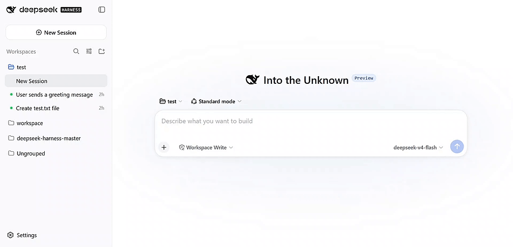
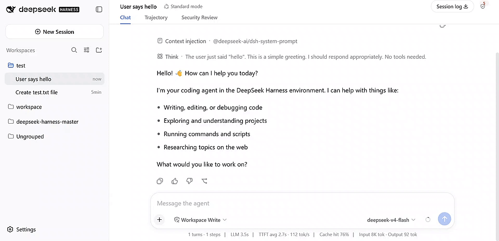
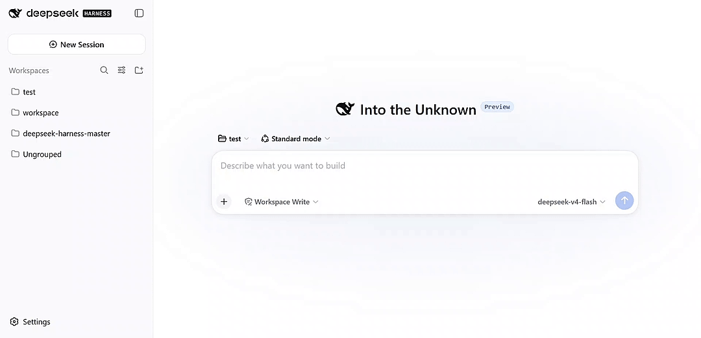

<p align="center">
  <strong>简体中文</strong> |
  <a href="./README.md">English</a>
</p>

# deepseek-harness-security-guard

一个基于本地规则引擎的 DeepSeek Harness agent 安全防护插件。在 agent 的工具调用与提示词装配钩子环节，按策略表做出 `allow` / `block` / `ask` / `warn` 决策。

<p align="center">
  <a href="https://github.com/SparkShieldLab/deepseek-harness-security-guard"></a>
  <a href="https://sai.xingdun-ai.com/home"></a>
  <a href="https://open.weixin.qq.com/qr/code?username=gh_89d544e1b8aa"></a>
</p>

<p align="center">
  <!-- 演示：提示注入攻击被拦截，随后在会话的 Security Review 标签页中查看判决与完整审查链 -->
  
</p>

## 功能特性

- **原生 hook 点**：守卫直接按原生 seam 名绑定 DeepSeek Harness 扩展点：`tools/pre-execute`、`tools/post-execute`、`tools/result`（仅观察）、`agent/pre-step`，并补充了 `agent/turn-stopping`（停止边界审查）、`agent/session-start` 与 `subagent/start`/`end`（仅观察）以及单调的 `ctx.tools.guard()` 仅拒绝不变量。
- **四种动作**：`allow` / `block` / `ask` / `warn`。`ask` 在 `tools/pre-execute` 走 harness 原生审批服务；在无审批的 hook 上自动降级为 block/reject。
- **内置基线防线**：开箱即用 27 条策略——高危命令、混淆/编码命令、超长命令（仅告警）、受保护路径、工作区外删除、循环风险、工件执行、外传链、工具结果提示注入（分 block/warn 两级）、用户意图攻击，以及提权、系统路径写入、配置篡改、沙箱逃逸、网络侦察、路径穿越、不可信源、HTTP 明文源、密钥落日志、记忆投毒等防线。
- **模型审查阶段（可选）**：规则引擎之外的第二阶段——渲染审查提示词交由大模型给出结构化判决，与规则判决按“就严合并”。session 模式复用 agent 当前模型；custom 模式通过 `openai-chat` / `openai-responses` / `anthropic` 协议调用专用端点。
- **提示词防护**：向 system-prompt 装配注入安全段落，让模型看到生效中的规则与当前会话风险上下文。
- **密钥泄露追踪**：携带工具结果中的密钥（原文 / base64 / hex）的出站命令被判为外传并被拦截或告警。
- **在线规则编辑**："安全守卫审查"面板（每个会话头部的盾牌按钮）实时查看判决日志并编辑规则，热加载生效。
- **会话判决标签页**：会话视图新增 "安全审查" 标签页，展示该会话的判决。
- **观测模式**：整张策略表跑观测模式，永不拒绝——`block`/`ask` 全部降级为 `warn` 并记录。
- **默认 failOpen**：引擎异常降级为 allow；`failOpen: false` 可改为失败即禁。

## 安装

**前置条件**：DSH 可正常启动（`dsh web`），Node.js ≥ 22，npm。

包尚未发布到 npm，先走源码安装：

```text
1. git clone <本仓库> && cd deepseek-harness-security-guard
2. npm install
3. ./build.sh --no-test
4. dsh plugin --profile web add "link:$(pwd)"
5. 重启 dsh web 并刷新浏览器
```

存在本地 `dsh` 安装时，`build.sh` 通过生成的 tsconfig `paths` 覆盖，将 `@deepseek-ai/*` 的类型解析指向 dsh 安装的 `node_modules` 做版本对齐（保证类型检查与运行中的 harness API 一致）；仅影响类型检查，**不会写入 `node_modules`**，因此反复 `npm install` 是安全的。没有本机 `dsh` 时回退到 `package.json` 声明的 registry 依赖，见 `build.sh`。

更新：`git pull && ./build.sh`，然后重启。

卸载：`dsh plugin --profile web remove @spark-shield-lab/deepseek-harness-security-guard`

包自带 bundle patch（`cordis.patch.yml`），插件自动挂载——无需在 `cordis.patch.yml` 里手工接线。默认带一份演示策略表（curl 需审批、提示词含私钥则拒绝），按需调整规则集。

## 控制面板

从会话头部的盾牌按钮打开 **安全守卫审查** 面板，有两个 tab：

- **Verdict Log（判决日志）**：来自插件自有本地审计文件（`$DSH_HOME/agent-security-guard/verdicts.jsonl`，面板再与活跃会话上下文关联）的跨会话判决轨迹。每行可展开看完整上下文：工具参数、工具结果文本（结果类 hook），或 hook 检查到的已装配提示词（`agent/pre-step` 在记录时持久化）。经过 harness 审批服务的 `ask` 判决会在行上直接标注人工决策结果（已通过 / 已拒绝）。`allow` 判决默认不落盘，日志保持精炼。
- **Rule Config（规则配置）**：在线编辑 / 保存，不用改 `cordis.yml` 也不用重启。

<p align="center">
  
</p>

插件还在会话视图环注册 **Security Review** tab：以表格展示该会话的判决，打开时每 4 秒轮询（在 DSH Settings 壳的 "Security Guard" 设置分区切换，`showSessionTab`）。

面板生命周期与文件总线语义：[docs/architecture.md](docs/architecture.zh-CN.md)。

完整参考——规则字段、算子（`eq` / `neq` / `contains` / `in` / `matches` / `regex`）、动作、内置基线表、优先级、观测模式——见 [docs/policy-table.md](docs/policy-table.zh-CN.md)。

## 模型审查

规则引擎之后的可选第二审查阶段（默认关闭，在盾牌面板设置里开启）。被守护的步骤会渲染一条或多条审查提示词发给模型，返回的结构化判决与规则判决按“就严合并”（`block` > `ask` > `warn` > `allow`）。规则层已判 `block` 时直接短路，不再发起模型调用——干净通过零成本。

- **模板**：内置三张基线模板卡片（`agent/pre-step` 恶意意图检测；`tools/pre-execute` 风险指令检测 + 意图偏离检测）；自定义模板是可编辑的提示词卡片，可绑定一个或多个 hook，在基线链之后执行。多模板判决就严合并，出现 `block` 即短路剩余模板。
- **session 模式**：通过 harness `llm` 服务复用 agent 当前模型，零额外配置。**custom 模式**：调用专用端点，协议可选 `openai-chat`（默认）、`openai-responses`、`anthropic`，支持推理链档位（`off` / `low` / `medium` / `high`），默认 12 秒截止时间约束额外延迟。
- **补审（make-up review）**：session 模式下，模型路由尚未就绪的步骤会先挂起，路由出现后补一次审查（仅审计、标注为迟到的判决）。
- **失败即放行（fail-open）**：模型审查失败或输出不可解析时回退到规则判决，反之则不然。
- **观测模式不破防**：`mode: monitor`（引擎级或单策略级）下，模型判决无法把已降级的 `warn` 再升级为拒绝——合并判决封顶在 `warn` 并标注降级。
- **全程可观测**：每次调用——请求体、响应体、耗时、错误——都作为独立行持久化在判决日志中，展示在面板的“模型审查” tab。

<p align="center">
  
</p>

## 后续计划

- **远程策略服务**：调用外部策略/风险服务，实现部署级、集中管控的规则体系。
- **扩展基线覆盖**：如Windows 专用命令。
- **判决日志审计**：判决日志导出、存数据库、用于审计。

## 致谢

衷心感谢长三角安全人工智能安徽省实验室的支持。

## 关于长三角安全人工智能安徽省实验室

长三角安全人工智能安徽省实验室致力于推动可信与安全人工智能的发展。我们的工作涵盖政策敏感场景、模型内容安全、智能体安全和严格的安全评估，并尤其关注复杂现实需求下的安全问题。我们欢迎这些方向的科研合作与产业合作，欢迎通过以下渠道与我们联系。

<p>
  <a href="https://sai.xingdun-ai.com/home"></a>
  <a href="https://open.weixin.qq.com/qr/code?username=gh_89d544e1b8aa"></a>
</p>

<p align="center">
  <strong>扫描下方二维码加入微信群。</strong>
</p>

<p align="center">
  
</p>

## 开源协议

MIT —— 见 [LICENSE](LICENSE)。